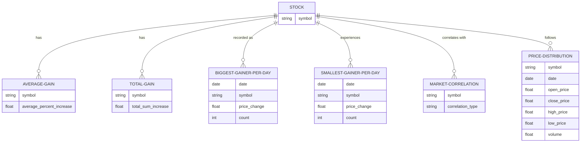

* Description of design:
    - I designed my ER diagram this way because I am looking for the best performing, yet stable stocks. I would like to see how much the stocks increase on average and 
      how much they increase in total over time. I am also interested in which stock gains the most each day and which stock has the least amount of change per day to compare.
      It would also be interesting to see if there is a stock that is positively correlated with the overall market, yet is very stable and experiences little changes. 
      Finally, it would be very helpful to visualize price distributions, while also taking into account closing, opening, highest, and lowest prices along with volume.

* Use Cases:
    - Picking stocks that gain the most on average or have the largest total gain.
    - Picking stocks that constantly gain the most or experience the smallest increases, but appear often so they might be the most stable
    - Percent of stocks that are correlated with overall market to understand if it is helpful to choose stocks that are correlated with it
    - Look at the distribution of prices to identify stocks that commonly perform well.
