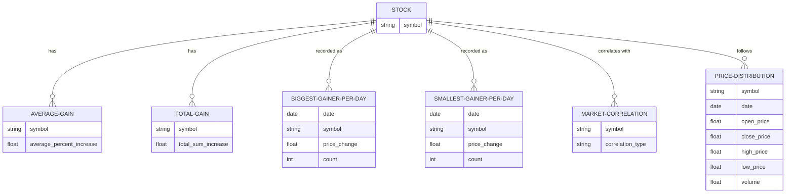

## Stock Data Analysis Report

This report presents an analysis of stock data collected over a five-day period from two websites – Yahoo and Wall Street Journal. The raw data was collected from these websites at least once per day and then normalized and cleaned to contain the following information: symbol, price, change in price from previous record, and percent change in price from previous record.

The goal of this report is to attempt to identify the best performing, yet stable stocks. The analysis of the data included exploring how much stocks increase on average and how much they increase in total over time. There was also exploration in terms of the stocks that gained the most each day and the stocks that gained the least each day. Lastly, it was important to identify stocks that are positively correlated to the market on average and assess price distributions while considering historic close price, open price, highest price, and lowest price along with volume within previous records. 

### Use Cases

This report presents various use cases for the analysis of this stock data. The first use case for this data is utilization by investors to pick stocks that have the highest percentage of change on average. The transformed data reveals that the top five stocks in terms of largest price percent change on average are the following: Marblegate Acquisition Corp., DatChat Inc., Desktop Metal Inc., Forte Biosciences Inc., and Zhengye Biotechnology Holding Ltd. Their average percent gain ranged from 27% growth to 108% growth, with Marblegate Acquisition Corp. having the highest percent growth over the five-day period. 

Another use case would be identifying companies that experienced the largest total price increase over the five-day period. The data revealed that Carvana Co., Crowdstrike Holdings Inc, Marblegate Acquisition Corp., MicroALgo Inc, and Banco Macro SA are the top five companies in this case. Carvana experienced the highest price changes over this period. It is important to note that Marblegate Acquisition Corp. also appears within this query so it may be an important contender for which companies to invest in.

Another use case is for investors to pick stocks that constantly gain the most or possibly experience smaller increases yet appear often as gainers within the data. This would possibly indicate stable stocks. The companies that gained the most each day were Crowdstrike Holdings Inc, Molina Healthcare Inc, AutoZone Inc, Marblegate Acquisition Corp., and CACI International Inc, with CACI International appearing the most within the collected stock gainer data. CACI International also sits within the midpoint of the price change ranges so it may be one of the most stable stocks. Marblegate Acquisition Corp also appears here. 

This data assessment could also be used to determine which stocks are correlated with the overall market so that stocks can be chosen based on expected market performance. There are only 27 companies out of 890 who were correlated with the overall marker during this five-day period. Some of those companies are repeats from previous analysis, such as Marblegate Acquisition Corp, Crowdstrike Holdings Inc, Desktop Metal Inc., and Carvana Co. This indicates that these may be beneficial stocks for when the market is projected to perform well.

The final use case presented in this report is the utilization of the historical stock data to identify stocks that commonly perform well. The companies explored here are Amazon and Accenture as they have previously demonstrated good performance within the stock market. However, it is important to explore how the current political state of the country is affecting their valuations. It was revealed that both Accenture and Amazon experienced stable growth in the past, however, they did not appear in the top companies within the gainer stock data for the five-day period. This may indicate that they may be more vulnerable to market instability, however, their valuations tend to stay high.

### Methods

The Figure above displays the Entity Relationship diagram of the stock data tables within Snowflake. SQL queries for creating these tables can be found within the projects/gainers/models/gainermodels directory within this Repo.

 
The tables represented within Figure 1 were created using various SQL queries to identify, extract, and transform the data. The Average Gain table was created by selecting all the normalized data and averaging by the percent of price change for each symbol. The Total Gain table was created by selecting the normalized data and summing based on price change to get the total amount of price change per symbol over the five-day period. The table demonstrating the Biggest Gainer Per Day was created by extracting the date and then finding the symbol that had the greatest price change each day by ordering in descending order and counting how many times the symbols appear over the five-day period. The Smallest Gainer Per Day table was similar to the Biggest Gainer table except it extracted the minimum price change per day by ordering the symbols in ascending order to select the lowest price changes. The Market Correlation table was created by combining the normalized data, extracting the dates, finding the market average by averaging the price changes of all available stock data and comparing the price change for each stock and the average market price change. A correlation function was used to determine the correlation amount, and each symbol was labeled “Y” or “N.” “Y” for yes when correlation was greater than 0.5 and “N” for no when the correlation was less than 0.5. The final table was created by combining historic stock data tables that contained symbol, date, open price, closing price, high price, low price and volume data.

### Summary

The analysis of the stock data presented within this report has answered a few questions of what stocks appear to be worth looking into further and potentially investing in. While there was a good amount of data included here, other data may provider further insights, such as longer historical data for more stocks or data on the public’s attitude towards some of these companies. If general attitude can be tracked, dips and increases in stocks may be more predictable.

Overall, the data reveals interesting patterns and demonstrates that it can be useful for analysis and support of future business decisions. Based on the information presented here, the recommended companies to investigate further include Marblegate Acquisition Corp., Crowdstrike Holdings Inc, and CACI International Inc. These companies appeared multiple times as high performers in the tables and seemed stable. While it can be tricky to decide which stocks to invest in, and especially from data collected during such a short period, the companies that appear promising were revealed with the analysis performed in this report.

